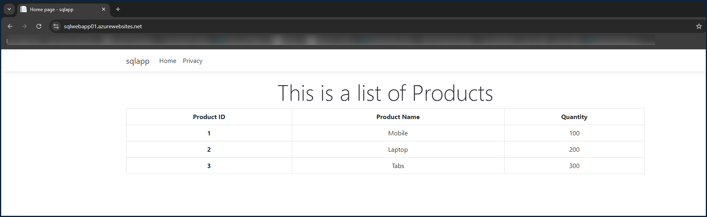
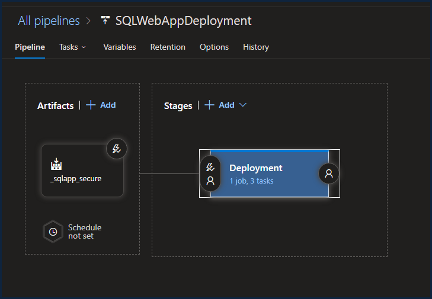
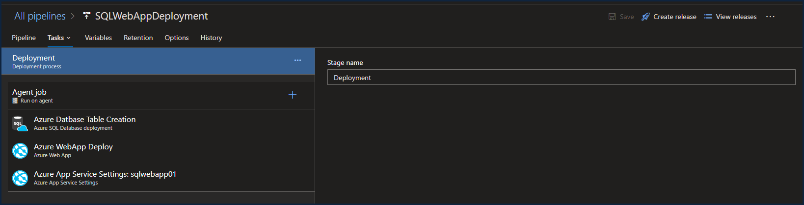

---

# Lab: Deploy an Azure WebApp Connected with Database using Azure Release Pipeline

## Overview

This lab demonstrates how to deploy an ASP.NET Core 6.0 LTS Razor web application connected to an Azure SQL Database using an Azure Release Pipeline. The web application retrieves a table of products from the SQL database. Upon successful deployment, the following page is displayed:



## Prerequisites

Before starting, ensure the following resources are deployed in Azure:

- **Resource Group**: `rg-sqlapp-eastus2`
- **Azure App Service Plan**: `appsvcplnsqlapp`
  - SKU: F1 Shared Hosting
  - Hosting: Windows
  - Runtime Stack: .NET 6.0
- **WebApp**: `webappsql`
  - Default settings
- **Azure SQL Server**: `sqlsvrwebappsql01`
  - Configuration: DTU-Based, Basic
  - Admin User: `sqlusr`
  - Password: *[Your Password]*
  - Allow access from Azure resources
  - Add client IP address
  - Default settings
- **Azure SQL Database**: `webappsqldb01`
  - Create the following table using the Query Editor in Azure Database:


```sql
IF (NOT EXISTS (SELECT * 
                FROM INFORMATION_SCHEMA.TABLES 
                WHERE TABLE_SCHEMA = 'dbo' 
                AND  TABLE_NAME = 'Products'))
BEGIN

    CREATE TABLE Products
    (
        ProductID int,
        ProductName varchar(1000),
        Quantity int
    )

    INSERT INTO Products(ProductID, ProductName, Quantity) VALUES (1, 'Mobile', 100)
    INSERT INTO Products(ProductID, ProductName, Quantity) VALUES (2, 'Laptop', 200)
    INSERT INTO Products(ProductID, ProductName, Quantity) VALUES (3, 'Tabs', 300)

END
```


## Database Connection Setup

### 1. Configure Database Connection in Azure WebApp

Instead of storing database credentials in your code, which is a bad practice, this lab will store credentials within the Azure WebApp, allowing secure connections to the SQL Database.

1. Go to **Azure App Service** -> **Settings** -> **Configuration** -> **Connection Strings**.
2. Add a new connection string with the following details:
   - **Name**: `SQLConnection`
   - **Value**: *[Database Connection String Goes Here]*
   - **Type**: `SQLAzure`

### 2. Retrieve Database Connection String

1. Navigate to your **SQL Database** -> **Overview**.
2. Copy the connection string for ADO.NET (SQL Authentication).
3. When pasting the connection string in the WebApp, ensure to input the correct password in place of `{your_password}`.

### 3. Update Code for Database Connection

In your ASP.NET Core application, update the code to retrieve the connection string using the same name (`SQLConnection`) you defined in Azure App Service.
Look at ProductService.cs

```csharp
        private SqlConnection GetConnection()
        {
        // The SQLConnection is the connection created between AzreWebapp and SQLDatabase
            return new SqlConnection(_configuration.GetConnectionString("SQLConnection"));
        }
```

## Build Pipeline Setup

1. Go to **Azure DevOps** -> **Organization** -> **Project** -> **Azure Pipelines** -> **Pipelines**.
2. Create a new pipeline with the following details:
   - **Pipeline Name**: `buildppsqlapp`
   - **Source Code**: GitHub Public Repo
   - Load the project using an existing YAML file.
3. Ensure to publish the `ArtifactStagingDirectory` as an artifact called `sql-secure-artifact`.
4. Run the build pipeline.

[Azure Pipeline YAML File Explanation](About_Pipeline.md)

## Release Pipeline Setup

(Use the WebApp Secure.json file to deploy the release pipeline using the import option ) 
The release pipeline consists of two parts:

1. **Artifact**: Ensure the correct artifact is specified.
2. **Deployment Stage (Stage 1)**: This stage includes the following jobs:

    - **Agent Job**: Executes environment commands and downloads the artifact.
    - **Azure Database Table Creation**: Update the inline script with the correct SQL query.
    - **Azure WebApp Deploy**: Deploys the web application.
    - **Azure App Service Settings**: Configures app service settings, including connection strings.

Should look something like this:






### Deployment Stage Configuration

1. **Artifact**:
   - Ensure the correct artifact is specified.

2. **Deployment**:
   - **Agent Job**: No additional configurations required.
   - **Azure SQL Table Creation**:
     - Update the inline script with the correct SQL query: [SQL Script](./scripts/script.sql)  
     

   - **Azure WebApp Deploy**: Deploy the web application. Search for 'Azure Web App' for windows and linux hosts. WebApp name is jus the webapp name in Azure , not fqdn. 
   - **Azure App Service Settings**:
     - **Display Name**: Azure App Service Settings
     - **Azure Subscription**: *[Select your subscription]*
     - **App Service Name**: *[Select your app service]*
     - **Resource Group**: *[Select your resource group]*
     - **Slot**: `production`
     - **Application Configuration Settings**:
       - **Connection Strings**: [Connection String Setting](./scripts/ConnectionStringSetting.json)
         - **Name**: `SQLConnection`
         - **Value**: *"Server=tcp:appserver6000.database.windows.net,1433;Initial Catalog=appdb;Persist Security Info=False;User ID=sqlusr;Password={your_password};MultipleActiveResultSets=False;Encrypt=True;TrustServerCertificate=False;Connection Timeout=30;",*
         - **Type**: `SQLAzure`
         - **Slot Settings**: `false`

### Running the Release Pipeline

Once the release pipeline is configured, run the pipeline to deploy the web application connected to the database.

---

